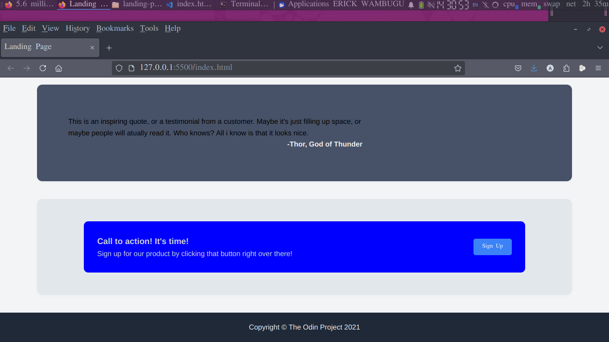
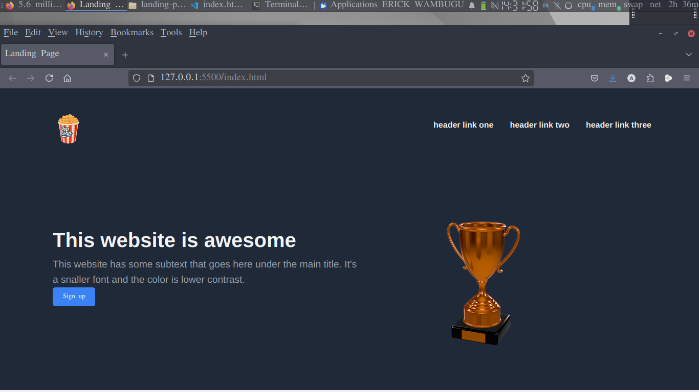

# Landing Page – The Odin Project

This repository contains my implementation of the **Landing Page** project from [The Odin Project](https://www.theodinproject.com/) curriculum. The goal of this project is to apply and demonstrate my understanding of HTML structure and CSS styling, including modern layout techniques such as Flexbox.

## Project Overview

The Landing Page project is a milestone in my web development learning journey. It challenges me to:

- Build a multi-section landing page using semantic HTML.
- Apply CSS for layout, spacing, and visual design.
- Utilize Flexbox for responsive and flexible layouts.
- Practice aligning, spacing, and organizing content professionally.
- Ensure the page is responsive and visually appealing on mobile, tablet, and desktop devices.

## What I Learned

Through this project, I have gained hands-on experience with:

- Structuring HTML documents for clarity and accessibility.
- Using CSS Flexbox to create responsive layouts.
- Managing spacing, alignment, and sizing for a polished look.
- Applying consistent color schemes and typography.
- Making web pages responsive for different screen sizes.

## Screenshots

 <!-- Add a screenshot if available -->
 <!-- Add a screenshot if available -->

## Getting Started

To view the landing page, simply open the `index.html` file in your web browser. No additional setup or installation is required.